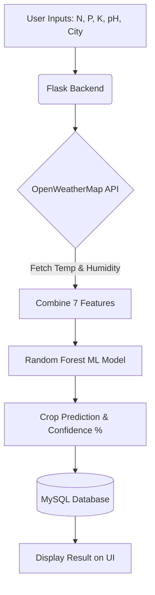

<div align="center">
  <h1>🌱 AI-Powered Smart Crop Advisor</h1>
  <p><strong>Intelligent Crop Recommendation System using Machine Learning & Real-Time Weather Data</strong></p>
  
  <p>
    
    
    
    
    
  </p>
</div>

<br>

A complete Full-Stack Machine Learning web application that analyzes soil nutrients (Nitrogen, Phosphorus, Potassium, pH) and fetches real-time weather data to recommend the most suitable crop for your farm.

---

## ✨ Key Features

- 🤖 **Machine Learning (Random Forest):** Highly accurate model trained on 22 different crop varieties.
- 🌤️ **Real-Time Weather Integration:** Automatically fetches live temperature and humidity for the user's city via the OpenWeatherMap API.
- 🔐 **User Authentication:** Secure Signup/Login system with password hashing (`werkzeug.security`).
- 📈 **Personalized Dashboard:** Registered users can track and view their historical crop predictions.
- 🗄️ **Relational Database:** MySQL integration to store user profiles and prediction histories safely.
- 🎨 **Premium UI:** Fully responsive, modern Glassmorphism dark-theme design.

---

## 📸 Screenshots

*(Add screenshots of your project here by placing them in the `static/images/` folder)*

- **Homepage & Features:** ``
- **Prediction Result:** ``
- **User Dashboard:** ``

---

## 🛠️ Tech Stack

| Category | Technologies Used |
|----------|-------------------|
| **Frontend** | HTML5, CSS3, Vanilla JavaScript |
| **Backend** | Python, Flask, Flask-Session |
| **Database** | MySQL, mysql-connector-python |
| **Machine Learning** | Scikit-Learn (Random Forest Classifier), Pandas, NumPy |
| **External Services** | OpenWeatherMap REST API |

---

## ⚙️ Local Setup & Installation

Follow these steps to run the project on your local machine.

### 1. Prerequisites
- Python 3.8+ installed
- MySQL Server installed and running
- Free API key from [OpenWeatherMap](https://openweathermap.org/api)

### 2. Clone the Repository
```bash
git clone https://github.com/Prajwal201204/AI-SMART-CROP-ADVISOR.git
cd AI-SMART-CROP-ADVISOR
```

### 3. Setup Virtual Environment
```bash
python -m venv .venv
# Windows
.venv\Scripts\activate
# Mac/Linux
source .venv/bin/activate
```

### 4. Install Dependencies
```bash
pip install -r requirements.txt
```

### 5. Configure Environment Variables
Open the `.env` file and configure your database and API credentials:
```env
DB_HOST=localhost
DB_USER=root
DB_PASSWORD=your_mysql_password
DB_NAME=smart_crop_dp
OPENWEATHER_API_KEY=your_api_key_here
SECRET_KEY=your_secret_flask_key
```

### 6. Train the Machine Learning Model
*(If the `.pkl` files are not present in the `/model` folder)*
```bash
python train_model.py
```

### 7. Run the Application
The backend will automatically create the required MySQL tables (`users` and `predictions`) on startup.
```bash
python app.py
```
**Access the app at:** `http://localhost:5000`

---

## 🧪 System Architecture & Flow



---

## 👨‍💻 Developer

- **Prajwal Newase**  
  [GitHub Profile](https://github.com/Prajwal201204)

---

## 📄 License
This project was developed as an independent portfolio project. 
© 2026 AI Smart Crop Advisor. All rights reserved.
